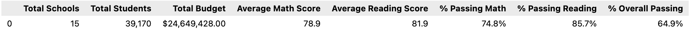
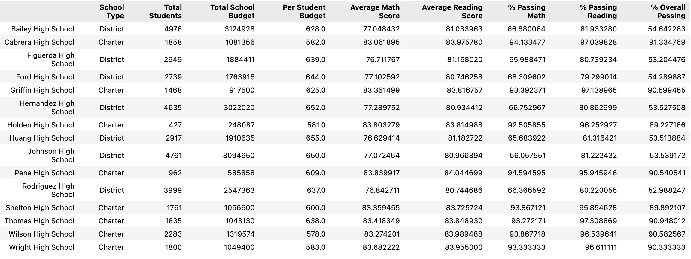

# School District Analysis
## Overview of the school district analysis:
The school district analysis that was completed in this module and which is summarized and presented below was done under the guidance of Maria, the chief data scientist for the school district.  Maria was charged with analyzing school and student performance data and providing summarized results and insights to inform the School Board's strategic decision making.

An initial analysis was completed and delivered to the Board, but the Board subsequently notified Maria that there were signs of academic dishonesty specifically related to the math and reading grades of ninth graders at Thomas High School.  We were asked to strip these grades out of the source data and redo the complete school district analysis. This report describes how the changes affected the overall analysis.

## Results:
To create the revised data for analysis, we needed to replace the Thomas High School ninth graders' math and reading scores with 'NaN' values.  This was accomplished by utilizing the `loc` method.  We passed conditionals to select just the Thomas High School `student_data_df["school_name"]=="Thomas High School"` and just the ninth grade `student_data_df["grade"]=="9th"` data from the DataFrame. We set this selection of grade data to np.nan, first for `reading_score` then for `math_score`:
```
student_data_df.loc[(student_data_df["grade"]=="9th") & (student_data_df["school_name"]=="Thomas High School"),["reading_score"]] = np.nan
student_data_df.loc[(student_data_df["grade"]=="9th") & (student_data_df["school_name"]=="Thomas High School"),["math_score"]] = np.nan
```

After making these changes and a few related modifications to calculate score percentages for Thomas High School based on only 10th-12th grade students, we compare the revised analysis to the original analysis to identify the key impacts:

- **District Summary**
  
  The original analysis showed:
  
  
  
  The revised analysis shows:

  

  The revised District Summary results have been slightly lowered as a result of the removal of the Thomas High School 9th grade scores.

  
    
- **School Summary**

  The original analysis showed:
  
  
  
  The revised analysis shows:

  

  The only line of the School Summary results that was impacted is the line reporting on Thomas High School. We can see by comparing the two images that the impact to scores was a slight lowering of each.  Thomas High School's performance as compared to other schools is not impacted by the change. They are still the second highest performing school based on '% Overall Passing'.

- **Math Scores by Grade**

  The original analysis showed:
  
  
  
  The revised analysis shows:

  

  In the revised analysis you see that the Thomas High School 9th grade results were replaced with NaN, as was requested.

- **Reading Scores by Grade**

  The original analysis showed:
  
  
  
  The revised analysis shows:

  

  In the revised analysis you see that the Thomas High School 9th grade results were replaced with NaN, as was requested.

- **Scores by Spending per Student**

  The original analysis showed:
  
  
  
  The revised analysis shows:

  

  The Thomas High School spending per capita is $638, so the revised results are reported in the $631-645 bin.  We see that the exclusion of the ninth graders' scores had no impact on the overall reported results.

- **Scores by School Size**

  The original analysis showed:
  
  
  
  The revised analysis shows:

  

  The Thomas High School size is 1,625 students, so the revised results are reported in the Medium schools bin.  We again see that the exclusion of the ninth graders' scores had no impact on the overall reported results.

- **Scores by School Type**

  The original analysis showed:
  
  
  
  The revised analysis shows:

  

  The Thomas High School is a Charter school.  We again see that the exclusion of the ninth graders' scores had no impact on the overall reported results.

## Summary:

In summary, the removal of the suspect Thomas High School 9th grade scores had a minimal impact on the results provided to the School District. The following summary changes were observed: 
1. Average Math Score dropped from 79.0 to 78.9.
2. % Passing Math dropped from 75.0% to 74.8%.
3. % Passing Reading dropped from 85.8% to 85.7%.
4. % Overall Passing dropped from 65.2% to 64.9%.
