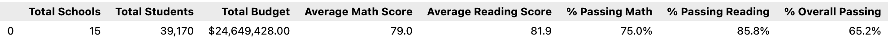

# School District Analysis
## Overview of the school district analysis:
The school district analysis that was completed in this module and which is summarized and presented below was done under the guidance of Maria, the chief data scientist for the school district.  Maria is charged with analyzing school and student performance data and providing summarized results and insights to inform the School Board's strategic decision making.

An initial analysis was completed and delivered to the Board, but the Board subsequently notified Maria that there were signs of academic dishonesty specifically related to the math and reading grades of ninth graders at Thomas High School.  We were asked to strip these grades out of the source data and redo the complete school district analysis. This report describes how the changes affected the overall analysis.

## Results:
There is a bulleted list that addresses how each of the seven school district metrics was affected by the changes in the data (10 pt).
TO DO: Describe how THS 9th grade data was found and replaced.

After making these changes, we are able to compare the revised analysis to the original analysis and identify the key impacts:
- District Summary
  
  The original analysis showed:
  
  
  
  The revised analysis shows:
  

  
- School Summary
- Math Scores by Grade
- Reading Scores by Grade
- Scores by Spending per Student
- Scores by School Size
- Scores by School Type

## Summary:

There is a statement summarizing four changes to the school district analysis after reading and math scores have been replaced (5 pt).
